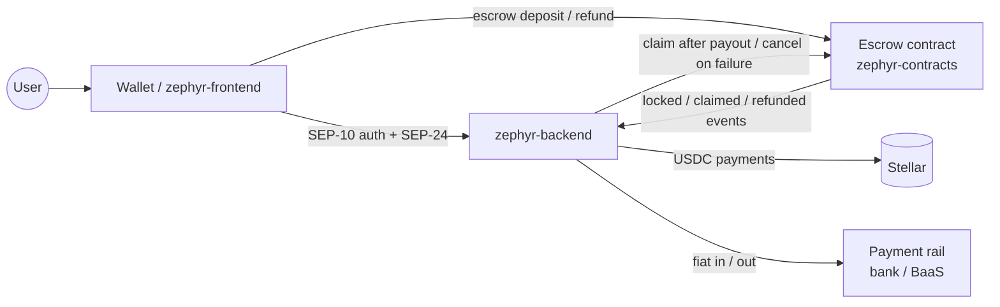

# Zephyr

**Zephyr** (a gentle west wind: fast, light money movement) is an open-source **USD ⇄ USDC on/off-ramp** for the [Stellar](https://stellar.org) network.

- **On-ramp:** send dollars by bank transfer, receive USDC in your Stellar wallet.
- **Off-ramp:** send USDC, receive dollars in your bank account. Optionally, lock your USDC in a **Soroban escrow** that refunds you if the anchor never pays out.

Zephyr speaks the Stellar standards wallets already use: [SEP-1](https://github.com/stellar/stellar-protocol/blob/master/ecosystem/sep-0001.md), [SEP-10](https://github.com/stellar/stellar-protocol/blob/master/ecosystem/sep-0010.md) and [SEP-24](https://github.com/stellar/stellar-protocol/blob/master/ecosystem/sep-0024.md).

> **Testnet only. Unaudited.** Don't use Zephyr with real money.

## Repositories

| Repo | Stack | What it does |
|---|---|---|
| [zephyr-backend](https://github.com/zephyr-ramp/zephyr-backend) | TypeScript, Fastify, PostgreSQL | Anchor server: SEP-1/10/24, transaction state machine and audit log, payment rails, Horizon and escrow watchers |
| [zephyr-frontend](https://github.com/zephyr-ramp/zephyr-frontend) | Next.js, Tailwind | SEP-24 interactive pages and a reference wallet (Freighter, xBull, Lobstr, Albedo) |
| [zephyr-contracts](https://github.com/zephyr-ramp/zephyr-contracts) | Rust, Soroban | Withdrawal escrow (lock → claim, or refund after timeout) and its TypeScript client |

## How it fits together

**Escrow withdrawal in one line:** you lock USDC in the contract for one withdrawal, the anchor pays your bank and only *then* claims it. If it doesn't act before the deadline, anyone can send your USDC back to you.

## Try it on testnet

1. Run [zephyr-backend](https://github.com/zephyr-ramp/zephyr-backend#quick-start-testnet) with `ENABLE_SANDBOX=true`, and [zephyr-frontend](https://github.com/zephyr-ramp/zephyr-frontend#quick-start) next to it (or `docker compose up` from the backend).
2. Open the wallet at `http://localhost:3000/app`, connect Freighter (testnet), sign in, add a USDC trustline.
3. **Deposit**, then simulate the bank transfer with `curl -X POST localhost:8080/sandbox/deposits/<id>/fiat-received`. Then **Withdraw with escrow**, lock your USDC, and watch it go *Locked → Claimed*.

Escrow on testnet: [`CCQCVQTYB45FXJG6BPLR4RPBMBOE4VD73MUMTDWT6Q55TXINSEBV3IOQ`](https://stellar.expert/explorer/testnet/contract/CCQCVQTYB45FXJG6BPLR4RPBMBOE4VD73MUMTDWT6Q55TXINSEBV3IOQ)

## Contribute in three steps

1. **Pick an issue** labelled `good first issue` or a [Drips Wave](https://www.drips.network/wave) issue in any repo. Complexity labels show the points: Trivial 100, Medium 150, High 200.
2. **Comment or apply through Drips Wave, and wait to be assigned** before you start.
3. **Follow that repo's `CONTRIBUTING.md`**: small conventional commits, tests, and a PR that links the issue.

Found a vulnerability? Please report it privately through the repo's **Security** tab. Never open a public issue for it.

## Maintainers

- [@N-thnI](https://github.com/N-thnI)
- [@N-i-xx](https://github.com/N-i-xx) (nixx)

## Contact

Security and code-of-conduct reports: [niheanyi404@gmail.com](mailto:niheanyi404@gmail.com) (or a private advisory in the repo's Security tab).
